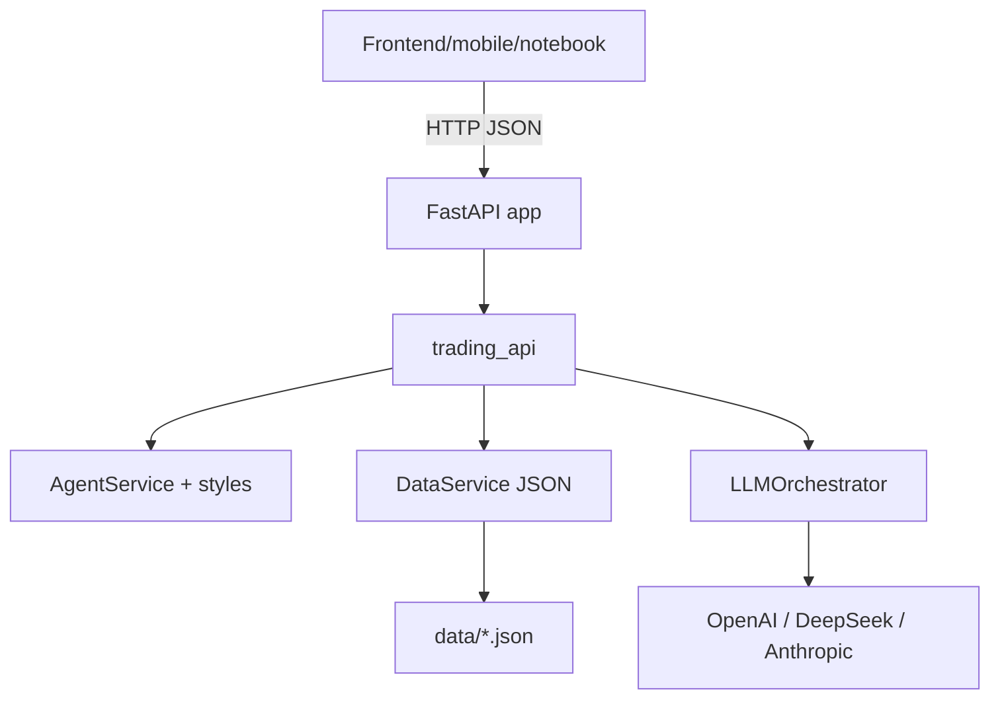
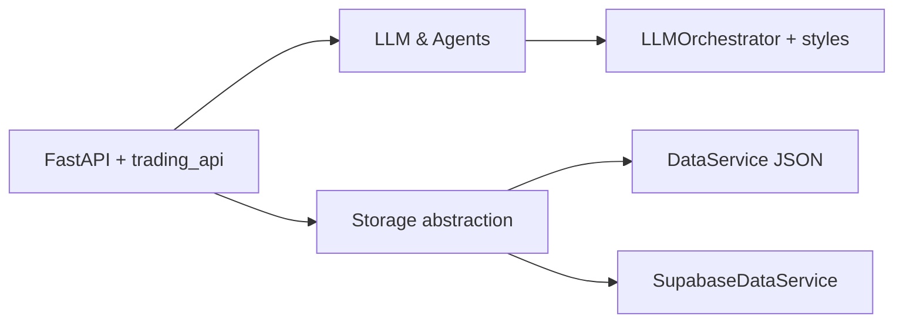

# Stock Fantasy API: AI Trading Fantasy League 🚀

**Simple backend for AI trading fantasy game. Pick AI agents, watch them trade, compete on returns.**

## Current State

- FastAPI API live in demo mode; persists to local JSON in `data/`.
- 10 agents (5 styles × ChatGPT/DeepSeek) generated on startup and cached to disk.
- LLM orchestration endpoints exist for probes; scheduled trading currently driven by the notebook/scripts.
- Supabase not wired yet; schema lives in `app/db_schema.sql` with handoff in `supabase/README.md`.

## ⚡ Quick Start

```bash
# Setup
python3 -m venv .venv && source .venv/bin/activate
pip install -r requirements.txt

# Add to app/.env:
# OPENAI_API_KEY=sk-proj-...
# DEEPSEEK_API_KEY=sk-...
# USE_LOCAL_STORAGE=true  # For demo, use JSON files (no database needed!)

# Run
uvicorn server:app --host 0.0.0.0 --port 3000 --reload
```

**Demo mode:** Uses local JSON files. No database setup required!
**Production:** Switch to Supabase when ready.

## Env Vars

```
OPENAI_API_KEY=...
DEEPSEEK_API_KEY=...
USE_LOCAL_STORAGE=true        # demo JSON (default)
# USE_LOCAL_STORAGE=false     # when Supabase backend is ready
# SUPABASE_URL=...
# SUPABASE_KEY=...
```

## Architecture Overview

- `server.py` is the entrypoint (runs `uvicorn`) and imports the FastAPI app from `app/__init__.py`.
- `app/__init__.py` builds the FastAPI instance, adds CORS + request logging, and mounts the main router.
- `app/api/trading_api.py` defines all `/api` routes (users, agents, trades, standings, LLM probes) and wires in the services below.
- `app/services/data_service.py` abstracts persistence; in demo mode it reads/writes `data/*.json` with a thread lock.
- `app/services/agent_service.py` builds the 10-agent catalog from `app/core/trading_styles.py` (prompts + styles × models).
- `app/core/llm_service.py` (used by the `/decisions/*` endpoints) fans out to OpenAI/DeepSeek/Anthropic via a common interface.



## Collaboration & Ownership

- LLM/Agents track: own `app/core/llm_service.py`, `app/core/trading_styles.py`, `app/services/agent_service.py`, and `/decisions/*` endpoints. See `docs/llm_agents.md`.
- Data/Supabase track: own storage swap-out. `app/services/storage_factory.py` chooses backend via `USE_LOCAL_STORAGE`. Local JSON stays default; Supabase stubs live in `app/services/supabase_service.py` with schema in `app/db_schema.sql` and handoff notes in `supabase/README.md`.

## Codebase Map (by workstream)

- Shared: `server.py` (uvicorn entry), `app/__init__.py` (FastAPI + CORS/logging), `app/api/trading_api.py` (all REST routes).
- LLM/Agents: `app/core/trading_styles.py` (prompts), `app/core/llm_service.py` (LLM orchestrator/providers), `app/services/agent_service.py` (builds 10-agent catalog), `docs/llm_agents.md` (track guide).
- Data/Persistence: `app/services/data_service.py` (demo JSON backend), `app/services/storage_factory.py` (backend switch), `app/services/supabase_service.py` (Supabase stub), `app/db_schema.sql` (Supabase schema), `supabase/README.md` (handoff), `data/*.json` (demo storage).
- Demo/tests: `notebooks/mvp_demo_playground.ipynb`, `notebooks/test_llm_connections.py` (LLM key check).



## How It Works

**For Users (Mobile App):**
1. Sign up
2. Pick 3-5 AI agents (once per month)
3. Watch agents trade weekly (backend cron or seeded trades)
4. See P&L standings, refreshed daily/weekly from recorded trades and price marks
5. Switch agents next month if desired

**Backend Does:**
- Every Monday: 10 agents analyze market → make trades
- Every Friday: Calculate P&L for all users
- Daily (optional): Mark positions to latest Yahoo prices to update P&L deltas
- Store everything in database (agent trades, user selections, P&L)

## Data Storage

### Demo Mode (Local JSON Files)

Local JSON files for quick MVP testing:

```
data/
├── agent_info.json       # 10 AI agents
├── agent_events.json     # All trades
├── user_info.json        # User accounts
├── user_events.json      # User agent selections
└── weekly_pnl.json       # Optional weekly snapshots
```

**Pros:** No database setup, easy to inspect, perfect for demo
**Cons:** Won't scale, single server only

> ⚠️ **Concurrency note:** Demo mode assumes a single FastAPI process so writes happen sequentially. Add a file lock if you expect simultaneous writes.

### Production Mode (Supabase)

See `supabase/README.md` and `app/db_schema.sql` for schema and handoff. API contracts stay the same; storage swaps via `USE_LOCAL_STORAGE=false`.

## 10 AI Agents

5 trading styles × 2 LLM models = 10 agents

| ID | Model | Style | What It Does |
|----|-------|-------|--------------|
| 1-2 | ChatGPT, DeepSeek | Conservative | Safe blue chips, hold long |
| 3-4 | ChatGPT, DeepSeek | Aggressive | High risk growth stocks |
| 5-6 | ChatGPT, DeepSeek | Momentum | Follow trends, ride winners |
| 7-8 | ChatGPT, DeepSeek | Mean Reversion | Buy dips, sell peaks |
| 9-10 | ChatGPT, DeepSeek | Balanced | Diversified, moderate risk |

Each agent gets market data (prices, RSI, MACD, etc.) and makes buy/sell/hold decision weekly.

## Playground vs Demo

- Quick client-side checks: run `notebooks/mvp_demo_playground.ipynb` (requires the FastAPI server) to:
  - sanity-check Yahoo Finance pulls,
  - fire a single LLM decision through the orchestrator,
  - and verify trades persist via the REST API.
- Code-path smoke tests: run `notebooks/code_function_playground.ipynb` to call `AgentService` and `DataService` directly (uses a sandbox copy of `data/`).
- Full two-week walkthrough (user selections, cron cadence, standings) lives in `DEMO_GUIDE.md`.

## API Endpoints (for Mobile App)

**User Management:**
- `POST /api/users/register` - Create account
- `GET /api/users/{id}` - Get user profile
- `GET /api/users/{id}/agents` - Get user's current agents

**Agent Selection:**
- `GET /api/agents` - List all 10 agents
- `POST /api/users/{id}/select-agents` - Pick 3-5 agents (monthly)
- `POST /api/users/{id}/drop-agent` - Drop an agent

**Standings & Performance:**
- `GET /api/standings` - Overall P&L rankings
- `GET /api/users/{id}/pnl` - User's portfolio performance
- `GET /api/agents/{id}/trades` - Agent's trade history with reasoning
- (LLM probes) `POST /api/decisions/run`, `POST /api/decisions/batch`

## Access Control (MVP)

- Single internal API key (`INTERNAL_API_KEY` env var) protects all endpoints during TestFlight; mobile app sends it in `X-Internal-Key`.
- Keys rotate manually for now; Supabase migration will add per-user auth + rate limits before external users join.

## Notes

- **Demo:** Local JSON files (no database needed); seed trades via `notebooks/mvp_demo_playground.ipynb`.
- **Production:** Supabase planned (see `supabase/README.md`).
- Paper trading only; mobile app connects via REST API.

**Status:** Demo-ready on local JSON; Supabase integration pending.
